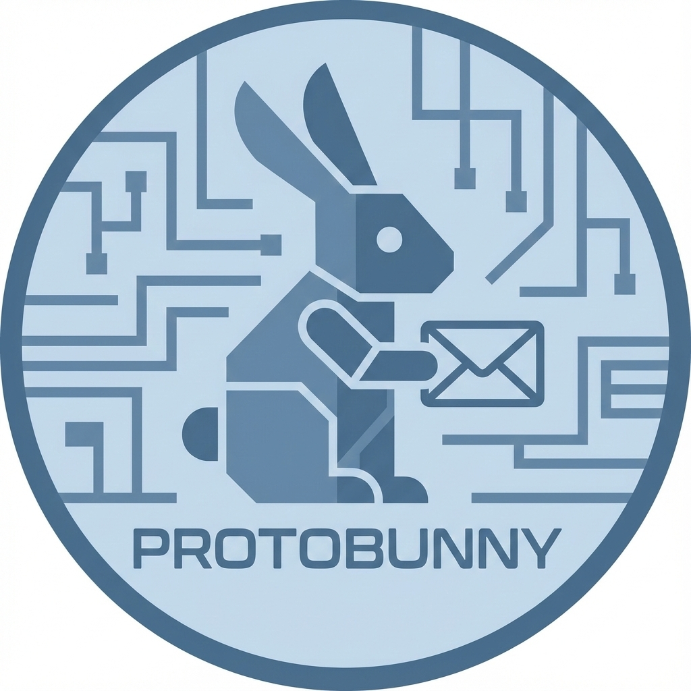

<div>
  
  <h1>Protobunny</h1>
</div>


The protobunny library simplifies messaging for asynchronous tasks by providing:

* connections facilities to RabbitMQ
* Protocol Buffers messages serialization/deserialization.

It focuses on a clean “message-first” API:

- Publish protobuf messages to **topic exchanges**
- Subscribe callbacks to message topics (including wildcard / package-level topics)
- Support “task-like” queues (shared/competing consumers) vs broadcast subscriptions
- Generate and consume `Result` messages (success/failure + optional return payload)
- Transparently serialize "JSON-like" payload fields (numpy-friendly)

## Requirements

- Python >= 3.10, < 3.13
- A running RabbitMQ instance (v4.0+ is preferred)
---

## Setup

### pyproject.toml
Add `protobunny` to your `pyproject.toml` dependencies:

```shell
uv add protobunny
# or
poetry add protobunny
```

You can also add it manually to pyproject.toml dependencies:
```toml
dependencies = [
  "protobunny>=0.1.0",
  # your other dependencies ...
]
```
Configure the library in pyproject.toml:
```toml
[tool.protobunny]
messages-directory = "messages"
messages-prefix = "acme"
generated-package-name = "mymessagelib.codegen"
```

### Install the library with `uv`, `poetry` or `pip`
```bash
uv lock  # or poetry lock
uv sync  # or poetry sync/install
```

### RabbitMQ connection
Protobunny connects to RabbitMQ using environment variables.

```shell
export RABBITMQ_HOST=localhost RABBITMQ_PORT=5672 RABBITMQ_USER=guest RABBITMQ_PASS=guest
```

```yaml
env:
  RABBITMQ_HOST: localhost
  RABBITMQ_PORT: 5672
  RABBITMQ_USER: guest
  RABBITMQ_PASS: guest
```

---

## Quick example

### Create a folder in your project with your protobuf messages
```shell
mkdir messages
mkdir messages/acme
# etc.
```
A message that uses JSON-like fields can look like this:
```protobuf
/*test.proto*/
syntax = "proto3";
import "protobunny/commons.proto";

package test;

message TestMessage {
  string content = 10;
  int64 number = 20;
  commons.JsonContent data = 25;
  /* Field with JSON-like content */
  optional string detail=30;
  /* Optional field */
}
```
### Generate your message library with `protobunny`
The library comes with a `protoc` wrapper that generates Python code from your protobuf messages 
and executes a postcompilation step to manipulate the generated code. 
Important note: the arguments must reflect the configuration in `pyproject.toml` in the section `tool.protobunny`, as showed above.

```shell
protobunny -I messages --python_betterproto_out=mymessagelib/codegen messages/**/*.proto messages/*.proto
```
In `mymessagelib/codegen` you should see the generated message classes, mirroring the `package` declaration in your protobuf files.

### Subscribe to a message
```python
import protobunny as pb
import mymessagelib as mml
def on_message(message: mml.test.TestMessage) -> None:
    print("Got:", message)

pb.subscribe(mml.test.TestMessage, on_message)
# Prints 
# 'Got: TestMessage(content="hello", number=1, data={"test": "test"}, detail=None)' 
# when a message is received
```
### Publish a message
The following code can run in another process or thread and publishes a message to the topic `acme.test.TestMessage`.
```python
import protobunny as pb
import mymessagelib as mml
msg =  mml.test.TestMessage(content="hello", number=1, data={"test": "test"})
pb.publish(msg)
```

## Concepts

### Topics

Every message class is associated with a **topic string**. 

Publishing sends your message to that topic; subscribing binds a queue to the same topic pattern.

Typical patterns:

- Exact topic: `pb.some.Package.Message`
- Wildcards: `pb.#` (subscribe to everything under `pb.`)
- Package-level subscription: subscribe to a module/package to receive multiple message types eg. `pb.some`

### Shared “task” queues vs broadcast subscriptions

Protobunny supports two common consumption models:

- **Broadcast / pub-sub**: each subscriber gets its own queue and receives its own copy of each message.
- **Shared / worker queue**: multiple consumers share one durable queue; messages are distributed among them (competing consumers).

Which one is used depends on the message/topic type and how the queue is defined by the library conventions.

### Results (reply-style messages)

For workflows that need an outcome, Protobunny supports publishing and subscribing to **result topics** associated with a source message.

A result typically contains:

- The original source message (embedded)
- A return code (success/failure)
- Optional `return_value` payload (often JSON-like)
- Optional error details

---


## Task-style queues
All messages that are under a `tasks` package are treated as shared queues.

```protobuf
/*
This .proto file contains protobuf message definitions for testing tasks
*/
syntax = "proto3";
import "protobunny/commons.proto";

// Define the tasks package
package tests.tasks;


message TaskMessage {
  string content = 10;
  repeated float weights = 30 [packed = true];
  repeated int64 bbox = 40 [packed = true];
  optional commons.JsonContent options=50;
}
```

If a message is treated as a "task queue" message by the library conventions, 
subscribing will use a **shared queue** (multiple workers, one queue).
The load is distributed among workers (competing consumers).

```python
import protobunny as pb

def worker1(task: pb.tests.tasks.TaskMessage) -> None:
    print("1- Working on:", task)

def worker2(task: pb.tests.tasks.TaskMessage) -> None:
    print("2- Working on:", task)

pb.subscribe(pb.tests.tasks.TaskMessage, worker1)
pb.subscribe(pb.tests.tasks.TaskMessage, worker2)
pb.publish(pb.tests.tasks.TaskMessage(content="test1"))
pb.publish(pb.tests.tasks.TaskMessage(content="test2"))
pb.publish(pb.tests.tasks.TaskMessage(content="test3"))
```

You can also introspect/manage an underlying shared queue:
```python

import protobunny as pb

queue = pb.get_queue(pb.tests.tasks.TaskMessage)

# Only shared queues can be purged and counted
count = queue.get_message_count()
print("Queued:", count)
queue.purge()
```
---

## Results workflow

### Create and publish a result
```python
import protobunny as pb

source = pb.tests.TestMessage(content="hello", number=1)

# create a result message from the source message
result = source.make_result(return_value={"ok": True})

pb.publish_result(result)
```

### Subscribe to results for a message type
```python

import protobunny as pb

def on_result(res: pb.results.Result) -> None:
    print("Result for:", res.source)
    print("Return code:", res.return_code)
    print("Return value:", res.return_value)
    print("Error:", res.error)

pb.subscribe_results(pb.tests.TestMessage, on_result)
```

---

## JSON-like content fields

Some protobuf fields are designed to carry arbitrary structured payloads (maps/dicts/lists). 
Protobunny supports transparent conversion so you can work with normal Python structures:

- Serialize: dictionaries/lists are encoded into the message field
- Deserialize: those fields come back as Python structures

This is particularly useful for metrics, metadata, and structured return values in results.

---

## Logging / debugging

Protobunny includes a convenience subscription for logging message traffic (for example, subscribing to a broad wildcard topic and printing JSON-ish payloads):
```python
import protobunny as pb

def log_callback(_incoming_message, body: str) -> None:
    print(body)

pb.subscribe_logger(log_callback)
```
---


If you need explicit connection lifecycle control, you can access the shared connection object:
```python
import protobunny as pb

conn = pb.get_connection()
# ...
pb.stop_connection()
```
---

## Development

### Run tests
```bash
uv run pytest
```

### Integration tests (RabbitMQ required)

Integration tests expect RabbitMQ to be running (for example via Docker Compose in this repo):
```bash
docker compose up -d
uv run pytest -m integration
```
---

## Project status / scope

Protobunny is designed for teams who use messaging to coordinate work between microservices and want:

- A small API surface, easy to learn and use
- Typed RabbitMQ messaging
- Consistent topic naming and routing
- Builtin task queue semantics and result messages
- Builtin logging service
- Transparent handling of JSON-like payload fields as plain dictionaries/lists
- Optional validation of required fields


### Future work

- Support sync/async grcp
- Support for RabbitMQ certificates (through `pika`)
- More backends:
  - Redis
  - multiprocessing.Queue or queue.Queue for simple local scenarios
  - NATS
  - Cloud providers (AWS SQS/SNS)
---

## License
`MIT`
Copyright (c) 2025 AM-Flow b.v.
